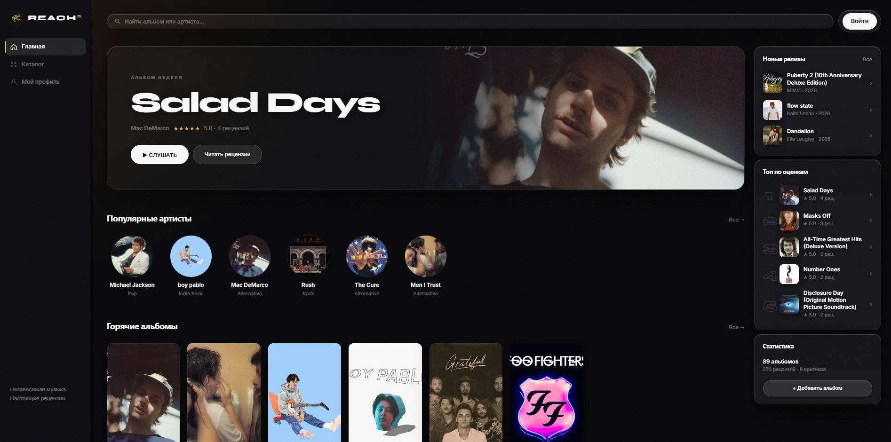

# Reach² — Music Review Platform

> Real feedback for independent music. / Настоящий фидбек для независимой музыки.



---

## English

**Reach²** is a community-driven music review platform built for independent artists and honest listeners. Find albums, leave a quick rating or a full-length review, and follow what your friends are listening to.

### Features

- Curated album catalog powered by the iTunes Search API (no key required)
- Rate albums 1–5 stars — quick rating or full review, your choice
- One review per user per album — edit or delete your own anytime
- Like reviews from other listeners
- Follow users — your feed shows only people you follow
- "Hot this week" — top albums by review activity in the last 7 days
- Personal profile: review history, listening stats, follower/following counts
- Edit your name and bio inline on your profile page
- 30-second track previews via iTunes (legally licensed)
- Auto-generated DiceBear avatars per user
- Real authentication — register, login, logout, bcrypt-hashed passwords
- Mobile-ready with bottom navigation

### Stack

| Layer | Choice |
|---|---|
| Framework | Next.js 14 · App Router |
| Auth | NextAuth.js v4 · Credentials · JWT |
| Storage | JSON flat-file `data/db.json` |
| Music data | iTunes Search API (free, no key) |
| Styling | Custom CSS · Liquid glass · Syne + Inter |
| Avatars | DiceBear API |
| Passwords | bcryptjs |

### Quick Start

```bash
npm install
npm run seed   # pulls real albums from iTunes → data/db.json
npm run dev    # → http://localhost:3000
```

**Demo login** (after seed):
```
email:    aidar@demo.reach2
password: demo123
```

### Environment

Create `.env.local` in the project root:

```env
NEXTAUTH_SECRET=your-secret-here
NEXTAUTH_URL=http://localhost:3000
```

### Deployment

Vercel won't work — the app writes to a local JSON file. Use **Railway** or **Render** (Node server) for hosting.

---

## Русский

**Reach²** — платформа для рецензий на музыку, созданная для независимых артистов и честных слушателей. Находи альбомы, ставь быстрые оценки или пиши полноценные рецензии, следи за тем, что слушают подписки.

### Возможности

- Каталог альбомов через iTunes Search API (без ключей и регистрации)
- Оценки 1–5 звёзд — быстрая оценка или полноценная рецензия на выбор
- Одна рецензия на пользователя на альбом — можно удалить и написать заново
- Лайки на рецензиях других пользователей
- Подписки на пользователей — лента показывает только тех, на кого подписан
- «Горячее за неделю» — топ альбомов по активности за последние 7 дней
- Личный профиль: история оценок, статистика, счётчики подписчиков/подписок
- Редактирование имени и bio прямо на странице профиля
- 30-секундные превью треков через iTunes (легально)
- Автоаватары DiceBear для каждого пользователя
- Настоящая авторизация — регистрация, вход, выход, пароли через bcrypt
- Мобильная версия с нижней навигацией

### Стек

| Слой | Технология |
|---|---|
| Фреймворк | Next.js 14 · App Router |
| Авторизация | NextAuth.js v4 · Credentials · JWT |
| Хранение данных | JSON-файл `data/db.json` |
| Музыкальные данные | iTunes Search API (бесплатно, без ключей) |
| Стили | Custom CSS · Liquid glass · Syne + Inter |
| Аватары | DiceBear API |
| Пароли | bcryptjs |

### Запуск

```bash
npm install
npm run seed   # загружает реальные альбомы из iTunes → data/db.json
npm run dev    # → http://localhost:3000
```

**Демо-вход** (после сида):
```
email:    aidar@demo.reach2
пароль:   demo123
```

### Переменные окружения

Создай `.env.local` в корне проекта:

```env
NEXTAUTH_SECRET=твой-секрет
NEXTAUTH_URL=http://localhost:3000
```

### Хостинг

Vercel не подойдёт — приложение пишет в локальный JSON-файл. Используй **Railway** или **Render** (Node-сервер).
